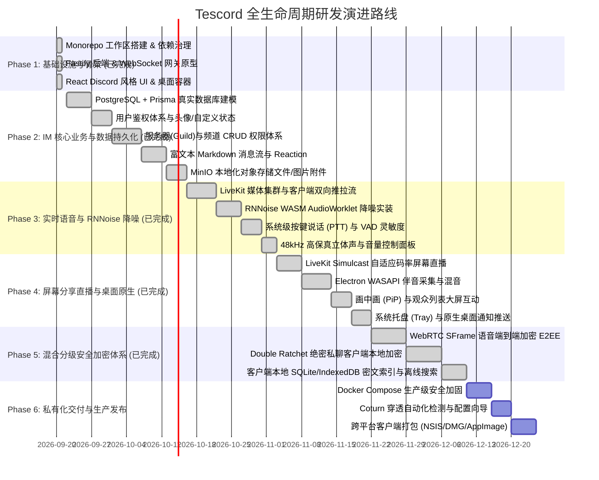

# 🗺️ Tescord 项目完整研发路线图 (Project Roadmap)

本文档制定了 **Tescord（类 Discord 本地私有化实时音视频与即时通讯系统）** 从原型骨架到生产级工业落地的完整研发路线规划。每个阶段均定义了核心目标、详细功能清单、技术实现要点与交付验收标准。

---

---

## 阶段一：基础设施与跨端脚手架 (Phase 1 - Foundation) `[已完成 ✅]`

- [x] **Monorepo 架构构建**：搭建基于 Turborepo + pnpm 的现代化多包体系（`types`, `server`, `web`, `desktop`）。
- [x] **统一协议与类型包 (`@tescord/types`)**：定义全套用户、公会、频道、消息、网关信令协议（OpCode 0~11）及音频处理结构。
- [x] **后端业务与网关原型 (`apps/server`)**：Fastify REST API 服务与 WebSocket Gateway（支持握手心跳保活、Token 鉴权、事件广播）。
- [x] **LiveKit Token 签发中心**：集成 `livekit-server-sdk`，实现离线 JWT 媒体访问令牌生成接口。
- [x] **前端核心界面 (`apps/web`)**：React 18 + Vite + Tailwind CSS 实现的 Discord 经典深色三栏界面与语音控制器。
- [x] **语音引擎管线桩 (`AudioEngine`)**：WebRTC APM、VAD 语音音量感应（呼吸绿圈高亮）、智能降噪控制面板。
- [x] **桌面端容器 (`apps/desktop`)**：Electron 30+ 容器封装，集成 `desktopCapturer` 多窗口屏幕采集与系统全局静音热键 (`Ctrl+Shift+M`)。
- [x] **基础部署编排 (`docker/`)**：提供包含 Postgres 16、Redis 7、MinIO、LiveKit SFU 与 Coturn 的 `docker-compose.yml`。

---

## 阶段二：IM 核心业务与数据持久化 (Phase 2 - IM & Persistence) `[已完成 ✅]`

### 2.1 数据库持久化演进（替换内存 Store） `[已完成 ✅]`

- [x] 接入 **Prisma ORM (SQLite 免依赖即开即用 + PostgreSQL 容器双模兼容)**。
- [x] 建立 `users`, `refresh_tokens`, `guilds`, `channels`, `members`, `roles`, `messages`, `reactions`, `attachments`, `invites` 完整表结构与自愈初始化。
- [x] 集成在线状态（Presence）与网关长连接心跳缓存（支持 Redis 7 与内存降级自愈）。

### 2.2 用户与鉴权体系 `[已完成 ✅]`

- [x] 基于 bcrypt 实现高强度密码哈希存储与安全校验。
- [x] JWT Access Token (15m) + Refresh Token (7d) 双令牌安全轮换刷新机制。
- [x] 个人资料编辑与状态管理：Zustand 状态驱动、自定义头像、状态指示灯（在线/离开/请勿打扰/隐身）、自定义个性签名与 Bio。

### 2.3 服务器 (Guild) 与频道深度控制 `[已完成 ✅]`

- [x] 服务器创建、名称/头像上传、专属邀请链接（含有效期与使用次数限制、一键复制邀请码）。
- [x] 频道文字/语音分类分栏、创建频道模态框与动态增删。
- [x] 基于位掩码（`PermissionFlags`）的角色与权限拦截校验（管理员、发言、发图、管理频道、连麦等）。

### 2.4 富文本即时消息流 `[已完成 ✅]`

- [x] 基于 `react-markdown` 与 `remark-gfm` 实现富文本解析（粗体、斜体、删除线、代码块、链接与 Discord 专属 `||剧透||` 点击显隐）。
- [x] 快捷 Emoji 表情选择器浮层与消息下方 Reaction 胶囊点赞互动及实时网关广播。
- [x] 消息引用回复（Quote Reply 携带作者名与原文字摘录）、Pin 置顶标记与删除/撤回权限控制。

### 2.5 MinIO 本地化对象存储附件系统 `[已完成 ✅]`

- [x] 服务端预签名直传 URL 签发中心（支持 MinIO S3 与本地 `uploads/` 目录双模无缝容灾自愈）。
- [x] 客户端直传文件降低服务端中继带宽开销、图片缩略图卡片渲染及全屏灯箱预览（Lightbox）。
- [x] 支持剪贴板直接 Ctrl+V 粘贴截图并自动直传发送。

---

## 阶段三：实时语音与 RNNoise 智能降噪引擎 (Phase 3 - Voice & AI Audio) `[已完成 ✅]`

### 3.1 LiveKit SFU 深度联动 `[已完成 ✅]`

- [x] 客户端无缝握手 LiveKit 媒体服务器，建立双向 WebRTC PeerConnection。
- [x] 麦克风音频推流（Opus 编码，码率从 16kbps 到 128kbps 动态可配）。
- [x] 多路远端语音拉流混合与独立音量调节（可对房间内特定用户单独调节 0%~200% 音量）。
- [x] 实时网络健康看板：查看本人及同伴的实时 RTT 往返延迟、丢包率与抖动（Jitter）。

### 3.2 RNNoise 神经网络降噪实装 `[已完成 ✅]`

- [x] 在客户端 Web Audio **AudioWorklet 线程** 中加载预编译的 `rnnoise.wasm` 深度循环神经网络模型。
- [x] 实现 480 采样点分帧处理管线，消除机械键盘轴体敲击声、笔记本风扇风噪与环境底噪。
- [x] 提供“降噪前后音频对比测试”录音小工具，让用户直观听到 AI 滤噪效果。

### 3.3 语音控制与高级模式 `[已完成 ✅]`

- [x] **按键说话 (Push-To-Talk)**：支持在 Web 端及 Electron 桌面端全局监听任意快捷键（如鼠标侧键、Caps Lock、Space）开麦。
- [x] **自适应 VAD (Voice Activity Detection)**：智能麦克风门限判定，音量低于阈值时完全静音不产生音频上行流量。
- [x] **音乐电台/高保真模式**：48kHz 采样率立体声直通，禁用回声消除和人声增益，供吉他弹唱或语音房伴奏直播。

---

## 阶段四：屏幕分享、直播与桌面原生增强 (Phase 4 - Go Live & Desktop) `[已完成 ✅]`

### 4.1 LiveKit Simulcast 超低延迟屏幕直播 `[已完成 ✅]`

- [x] 捕获全屏幕或指定程序窗口（1080p 60fps / 720p 30fps）。
- [x] 开启 LiveKit **Simulcast (多清晰度广播)**，大群观众根据自身网络自适应拉取合适码率，杜绝卡顿。
- [x] 观众端低延迟互动（延时 < 200ms），支持全屏、剧场模式与画中画 (Picture-in-Picture) 浮动小窗。

### 4.2 Electron 桌面端声卡混音（独占特性） `[已完成 ✅]`

- [x] 利用 Windows WASAPI Loopback 或原生音频驱动，实现采集特定游戏/应用程序的原生声音。
- [x] 将游戏伴音与麦克风人声在客户端原生合成立体声推流至直播频道。

### 4.3 桌面端体验增强 `[已完成 ✅]`

- [x] 系统托盘图标（System Tray）：后台常驻、托盘右键菜单（快速切换在线状态、快速退出）。
- [x] 原生系统通知推送：有好友 @提及 或私信时弹出桌面通知，支持点击直接定位跳转。
- [x] 开机自启动与单例进程保护（防止重复打开多个客户端）。

---

## 阶段五：混合分级安全加密体系 (Phase 5 - E2EE Security) `[已完成 ✅]`

### 5.1 基础链路安全与网络加固 `[已完成 ✅]`

- [x] 生产反向代理强制启用 **TLS 1.3** 与 **HSTS**（31536000s + includeSubDomains + preload）。
- [x] WebRTC 媒体链路强制开启 **DTLS-SRTP**，通信包网络中继全程密文传输。

### 5.2 语音端到端加密（SFrame E2EE） `[已完成 ✅]`

- [x] 接入 **WebRTC Insertable Streams + SFrame** (IETF draft-ietf-sframe-enc) 规范。
- [x] 客户端在音频帧出网前使用由群组协商的共享密码进行 SFrame 密文封装与滑动窗口防重放攻击。
- [x] LiveKit SFU 媒体服务器仅充当“盲中继”，即便物理服务器遭受入侵，亦无法截获或监听语音明文。

### 5.3 绝密频道端到端文本加密 `[已完成 ✅]`

- [x] 采用 **Double Ratchet (双棘轮)** 算法（ECDH P-256 + HKDF-SHA256 + AES-256-GCM）。
- [x] 客户端在本地生成非对称公私钥对，公钥上链，私钥仅保存于用户设备本地。
- [x] 服务器数据库仅存储密文信封（Ciphertext），管理员无明文查看权限。
- [x] 客户端本地采用 **IndexedDB / 倒排索引引擎** 构建端侧密文全文本检索。

---

## 阶段六：本地私有化交付、部署运维与发布 (Phase 6 - Release & Ops)

### 6.1 生产级 Docker Compose 编排

- [ ] 编写一键部署主配置与 `.env.production` 模版。
- [ ] 内置 **Nginx / Caddy** 自动申请与续签 Let's Encrypt SSL 证书（公网部署）或自签名证书（局域网部署）。
- [ ] 容器健康检查（Healthcheck）、故障自愈与日志轮转配置。

### 6.2 Coturn NAT 穿透与外网打洞自动化向导

- [ ] 编写网络诊断脚本 `tescord-doctor`：自动检测服务器公网 IP、UDP 端口可达性与 NAT 映射类型。
- [ ] 自动生成 Coturn 配置文件与短期认证令牌（REST API Ephemeral Credential）。

### 6.3 多平台安装包自动化发布

- [ ] Windows 平台：使用 electron-builder 构建 `.exe` (NSIS 安装包及绿色免安装版)。
- [ ] Linux 平台：构建 `.AppImage` 与 `.deb` 包。
- [ ] macOS 平台：构建 `.dmg` (Universal / Apple Silicon & Intel)。
