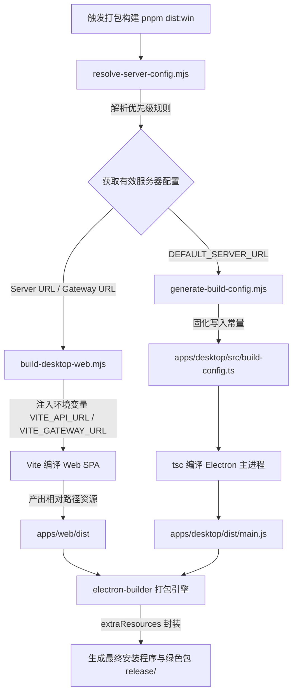

# @tescord/desktop - Tescord 桌面客户端

Tescord 桌面客户端是基于 **Electron**、**React 18**、**better-sqlite3** 与 **WebRTC / RNNoise** 深度定制的私有化即时通信与音视频协同桌面端应用。提供 Discord 像素级交互体验、纯粹的私有化与离线自治保障、操作系统原生级托盘与悬浮通知、以及低至毫秒级的硬件级实时通信。

---

## 目录

- [一、架构与设计概览](#一架构与设计概览)
- [二、编译环境与先决条件](#二编译环境与先决条件)
- [三、编译期服务器地址定制指南 (核心)](#三编译期服务器地址定制指南-核心)
  - [3.1 为什么采用编译期固化](#31-为什么采用编译期固化)
  - [3.2 方式一：命令行环境变量 (CI/CD 与快捷打包推荐)](#32-方式一命令行环境变量-cicd-与快捷打包推荐)
  - [3.3 方式二：专用配置文件 desktop.config.json (定制分发推荐)](#33-方式二专用配置文件-desktopconfigjson-定制分发推荐)
  - [3.4 方式三：.env 环境变量文件](#34-方式三env-环境变量文件)
  - [3.5 配置解析优先级与自动推导规则](#35-配置解析优先级与自动推导规则)
- [四、构建与打包命令指南](#四构建与打包命令指南)
  - [4.1 本地联调与开发](#41-本地联调与开发)
  - [4.2 编译主进程与原生依赖](#42-编译主进程与原生依赖)
  - [4.3 全平台生产安装包构建](#43-全平台生产安装包构建)
- [五、编译流水线深度解析](#五编译流水线深度解析)
- [六、常见问题与故障排查 (Troubleshooting)](#六常见问题与故障排查-troubleshooting)

---

## 一、架构与设计概览

Tescord 客户端采用**双进程强隔离**与**离线本地加载**设计：

- **主进程 (Main Process)**：
  - 位于 `apps/desktop/src/main.ts`，基于 Node.js 原生环境；
  - 负责原生窗口生命周期、多实例单例锁定、硬件编解码优化、操作系统托盘（Tray）与全局热键（PTT 全局静音/开麦）；
  - 持有 `better-sqlite3`（通过 `utilityProcess` 隔离子进程运行，具备 safeStorage 原生凭据加密与 FTS5 全文搜索）；
  - 负责双轨增量热更新（Ed25519 签名校验、增量解压与安全沙箱防护）。
- **渲染进程 (Renderer Process)**：
  - 由 `@tescord/web` 编译出的静态单页应用（SPA）产物组成；
  - 生产打包后随安装包打包至 `resources/web/dist`，主进程通过 `file://` 离线协议加载，实现秒级冷启动与零网络白屏；
  - 通过 `preload.ts` 暴露的安全上下文 `window.electronAPI` 桥接原生系统能力。

---

## 二、编译环境与先决条件

在开始编译或打包桌面客户端前，请确保开发环境满足以下要求：

| 工具 / 依赖        | 最低版本要求 | 说明与用途                                               |
| :----------------- | :----------- | :------------------------------------------------------- |
| **Node.js**        | `22.x`       | 与 CI 验证环境一致                                       |
| **pnpm**           | `11.9.0`     | 使用根目录 packageManager 指定版本，请勿使用 npm 或 yarn |
| **Python**         | `>= 3.8`     | `node-gyp` 编译原生 C++ 模块时的依赖                     |
| **C++ 编译工具链** | 详见右侧     | 用于编译 `better-sqlite3` 原生模块与 `rnnoise` 降噪组件  |

### 操作系统编译工具安装指导：

- **Windows 操作系统**：
  - 安装 [Visual Studio 2022 社区版](https://visualstudio.microsoft.com/zh-hans/vs/)，安装时勾选 **“使用 C++ 的桌面开发”**（Desktop development with C++）；
  - 同时安装 Python，并确认 Visual Studio 安装了 Windows SDK。
- **macOS 操作系统**：
  - 终端运行命令安装 Xcode 命令行工具：
    ```bash
    xcode-select --install
    ```
- **Linux 操作系统 (Ubuntu / Debian)**：
  - 运行命令安装原生构建套件与音频开发头文件：
    ```bash
    sudo apt-get update && sudo apt-get install -y build-essential python3 libasound2-dev
    ```

---

## 三、编译期服务器地址定制指南 (核心)

### 3.1 为什么采用编译期固化

为了保障企业私有化部署的安全一致性与“开箱即用”的分发体验，Tescord Electron 客户端在打包时将目标服务端地址直接固化在安装包内。分发给团队或租户的安装程序无需用户手动填写复杂的后端或 WebSocket 地址，双击安装即可直连指定的私有服务器。

系统提供了 **3 种灵活的配置方式**，构建系统（`scripts/build-desktop-web.mjs` 与 `scripts/generate-build-config.mjs`）会自动完成统一解析与双端注入。

---

### 3.2 方式一：命令行环境变量 (CI/CD 与快捷打包推荐)

在执行构建或打包脚本前，通过设置环境变量 `TESCORD_SERVER_URL` 指定目标服务器。

#### Windows PowerShell：

```powershell
# 1. 临时设置环境变量并执行 Windows 生产打包
$env:TESCORD_SERVER_URL = "https://tescord.yourcompany.com"
pnpm --filter @tescord/desktop run dist:win

# 2. 或在根目录下快捷执行 (如果配置了全局打包脚本)
$env:TESCORD_SERVER_URL = "http://192.168.1.100:3001"
pnpm run dev:desktop
```

#### Windows CMD：

```cmd
set TESCORD_SERVER_URL=https://tescord.yourcompany.com
pnpm --filter @tescord/desktop run dist:win
```

#### macOS / Linux Bash / Zsh：

```bash
# 单行命令注入并打包
TESCORD_SERVER_URL="https://tescord.yourcompany.com" pnpm --filter @tescord/desktop run dist:mac
```

> [!TIP]
> 针对有自定义网关或 SFU 域名的复杂生产网络拓扑，还支持可选指定配套变量：
>
> - `TESCORD_GATEWAY_URL`：显式指定 WebSocket Gateway 地址（默认根据 Server URL 自动派生）
> - `TESCORD_LIVEKIT_URL`：显式指定 LiveKit 媒体服务器地址
> - `VITE_VOICE_ENGINE`：`livekit`（默认）或 `cloudflare_realtime`；Cloudflare 部署需选择后者。

安装器宿主会在加载本地页面时提供固定的服务器地址和媒体引擎；应用通用的签名 Web 增量包后仍连接原部署。HTTP 浏览器页面不会采用桌面 URL 参数。

---

### 3.3 方式二：专用配置文件 desktop.config.json (定制分发推荐)

在 `apps/desktop/` 目录下创建 `desktop.config.json` 文件（可直接基于模板 `desktop.config.example.json` 复制修改）：

```bash
# 拷贝示例模板
cp apps/desktop/desktop.config.example.json apps/desktop/desktop.config.json
```

编辑 `apps/desktop/desktop.config.json` 内容：

```json
{
  "$schema": "http://json-schema.org/draft-07/schema#",
  "serverUrl": "https://chat.example.com",
  "gatewayUrl": "wss://chat.example.com/gateway",
  "livekitUrl": "wss://livekit.example.com"
}
```

#### 配置字段说明：

| 字段名       | 类型     | 必填   | 说明                                                      | 示例                             |
| :----------- | :------- | :----- | :-------------------------------------------------------- | :------------------------------- |
| `serverUrl`  | `string` | **是** | 服务端 REST API 根地址 (支持 HTTP/HTTPS，可带端口)        | `"https://im.company.com"`       |
| `gatewayUrl` | `string` | 否     | WebSocket 网关地址；若省略，系统自动根据 `serverUrl` 推导 | `"wss://im.company.com/gateway"` |
| `livekitUrl` | `string` | 否     | LiveKit SFU 媒体服务地址；若省略则遵循服务端动态下发配置  | `"wss://livekit.company.com"`    |

> [!NOTE]
> `apps/desktop/desktop.config.json` 已加入根目录 `.gitignore`。地址仍会写入构建产物和构建日志，请勿在 URL 中包含密码、令牌或其他秘密。

---

### 3.4 方式三：.env 环境变量文件

系统同样支持在 `.env` 文件中声明配置：

- **桌面端专用**：在 `apps/desktop/.env` 中添加：
  ```env
  TESCORD_SERVER_URL=https://tescord.myorg.org
  ```
- **项目根目录全局**：在仓库根目录 `.env` 中添加：
  ```env
  TESCORD_SERVER_URL=https://tescord.myorg.org
  ```

---

### 3.5 配置解析优先级与自动推导规则

构建系统对 API、Gateway 和 LiveKit 三个字段分别按照以下优先级解析；进程中的单独 Gateway 配置可以覆盖文件中的 Gateway，同时保留文件中的 API 地址。非法协议、URL 凭证、查询参数、片段和非字符串配置会终止构建。

```text
┌─────────────────────────────────────────────────────────────┐
│ 1. 进程环境变量 (process.env.TESCORD_SERVER_URL / VITE_API_URL) │ (最高优先级)
└──────────────────────────────┬──────────────────────────────┘
                               │ 未指定时向下回退
┌──────────────────────────────▼──────────────────────────────┐
│ 2. 桌面配置文件 (apps/desktop/desktop.config.json)           │
└──────────────────────────────┬──────────────────────────────┘
                               │ 未指定时向下回退
┌──────────────────────────────▼──────────────────────────────┐
│ 3. 桌面环境文件 (apps/desktop/.env)                          │
└──────────────────────────────┬──────────────────────────────┘
                               │ 未指定时向下回退
┌──────────────────────────────▼──────────────────────────────┐
│ 4. 根目录环境文件 (根目录 .env)                             │
└──────────────────────────────┬──────────────────────────────┘
                               │ 未指定时向下回退
┌──────────────────────────────▼──────────────────────────────┐
│ 5. 保底默认值 (本地自宿主模式 http://localhost:3001)        │ (最低优先级)
└─────────────────────────────────────────────────────────────┘
```

#### 智能 Gateway URL 自动派生算法：

若仅配置了 `serverUrl` 而未配置 `gatewayUrl`，系统会自动推导：

- `https://tescord.com` $\rightarrow$ `wss://tescord.com/gateway`
- `http://192.168.1.100:3001` $\rightarrow$ `ws://192.168.1.100:3001/gateway`
- 若基础 URL 带有二级目录（如 `https://example.com/tescord`），将精准推导为 `wss://example.com/tescord/gateway`。

---

## 四、构建与打包命令指南

所有的命令均可在**项目根目录**或进入 `apps/desktop` 目录执行（推荐在项目根目录统一调度）。

### 4.1 本地联调与开发

启动桌面端开发模式（会自动编译 Web 资源、启动原生模块与 Electron 窗口）：

```bash
# 根目录下执行
pnpm dev:desktop

# 或在 apps/desktop 目录下执行
cd apps/desktop
pnpm dev
```

> [!TIP]
> 若需使用自定义服务器进行本地桌面端联调，直接带上环境变量即可：
>
> ```bash
> TESCORD_SERVER_URL="https://tescord.yourcompany.com" pnpm dev:desktop
> ```

---

### 4.2 编译主进程与原生依赖

仅执行主进程与原生代码编译（不执行最终安装包封装）：

```bash
# 进入桌面端目录
cd apps/desktop

# 执行全套编译链路
pnpm build
```

该命令会自动依序执行：

1. 运行 `scripts/generate-build-config.mjs` 生成 `build-config.ts`；
2. 编译 RNNoise C++ 原生降噪 Node Addon (`build:native`)；
3. 基于当前 Electron 版本重建 `better-sqlite3` 原生模块 (`build:sqlite`)；
4. 调用 TypeScript 编译器 `tsc` 输出主进程代码至 `dist/`；
5. 拷贝 Splash 资源与推理 Worker 脚本 (`copy-assets`)。

---

### 4.3 全平台生产安装包构建

打包命令使用 `electron-builder` 结合 `scripts/build-desktop-web.mjs`，生成完整内嵌 Web 资源与固化服务器配置的可分发安装程序。

#### 1. 构建 Windows 安装包与免安装绿色版 (NSIS / Zip)

```bash
# 根目录下执行
TESCORD_SERVER_URL="https://im.company.com" pnpm --filter @tescord/desktop run dist:win

# 或在 apps/desktop 目录下执行
cd apps/desktop
$env:TESCORD_SERVER_URL = "https://im.company.com"
pnpm run dist:win
```

**产物位置**：`apps/desktop/release/`

- `Tescord-Setup-0.3.0.exe`：全功能 NSIS 安装向导程序（支持自定义安装路径、创建桌面快捷方式与开始菜单入口）；
- `Tescord-0.3.0-win.zip`：便携免安装压缩包，解压后双击 `Tescord.exe` 即可直接运行。

#### 2. 构建 macOS 安装镜像与归档包 (DMG / Zip)

```bash
# macOS 环境下执行，生成与当前构建机架构一致的安装包
TESCORD_SERVER_URL="https://im.company.com" pnpm --filter @tescord/desktop run dist:mac
```

**产物位置**：`apps/desktop/release/`

- `Tescord-0.3.0.dmg`：macOS 拖拽安装镜像包；
- `Tescord-0.3.0-mac.zip`：便携压缩包。

Apple Silicon 构建机对应产物带 `-arm64` 后缀。Electron、RNNoise 与 SQLite 原生模块必须使用相同架构；发布流水线分别使用 Intel 与 Apple Silicon 构建机，检查最终应用的架构、音视频权限说明和五种语言的权限资源。请在相应架构的 macOS 上构建，不要将单一架构的原生模块复制到另一架构的安装包。

#### 3. 构建 Linux 安装包 (AppImage / Deb)

```bash
# Linux 环境下执行
TESCORD_SERVER_URL="https://im.company.com" pnpm --filter @tescord/desktop run dist
```

---

## 五、编译流水线深度解析

为保证从源代码到可执行文件的绝对确定性，构建流水线包含以下严格的流转顺序：



1. **统一解析阶段 (`scripts/resolve-server-config.mjs`)**：
   从进程参数、`desktop.config.json` 或 `.env` 中提取并推导 API 与 Gateway 地址；
2. **Web 静态捆绑阶段 (`scripts/build-desktop-web.mjs`)**：
   以 `BUILD_TARGET="desktop"` 触发 Vite 构建，Vite 在 AST 转换期间将前端所有的 `import.meta.env.VITE_API_URL` 替换为写死的字符串常量；
3. **主进程固化阶段 (`scripts/generate-build-config.mjs`)**：
   将服务器配置、构建时间戳、更新签名 Ed25519 公钥等写入 `build-config.ts`；
4. **原生组件集成阶段**：
   确保 `rnnoise` 原生 C++ 降噪模块与 `better-sqlite3` 二进制针对 Electron 当前 Node ABI 正确对齐；
5. **打包分发阶段 (`electron-builder`)**：
   将 `apps/web/dist` 作为 `extraResources` 写入安装包的 `resources/web/dist`，生成最终安装程序。

---

## 六、常见问题与故障排查 (Troubleshooting)

### Q1: 编译原生模块时报 `MSB8020` 或 `gyp ERR! find VS` 错误？

- **原因**：本地缺少 Windows C++ 构建工具或未配置 Python 环境。
- **解决方案**：
  1. 确认已安装 Visual Studio 2022 并包含“使用 C++ 的桌面开发”工作负载；
  2. 确认已安装 Python 3，且可以在终端中运行 `python --version`；
  3. 在 Visual Studio Installer 中确认 C++ 工具集与 Windows SDK 已安装，再重新运行 pnpm 构建。

### Q2: 启动或运行时报错 `The module '...better-sqlite3.node' was compiled against a different Node.js version`？

- **原因**：`better-sqlite3` 是用宿主 Node.js 的 ABI 编译的，与 Electron 内嵌的 Chromium/Node ABI 不匹配。
- **解决方案**：
  在 `apps/desktop` 目录下执行依赖重构命令：
  ```bash
  pnpm run build:sqlite
  # 该命令等价于: electron-builder install-app-deps
  ```

### Q3: 打包时下载 Electron 预编译包极度缓慢或网络超时？

- **原因**：默认访问 GitHub Release 下载 Electron 核心二进制包，国内网络环境下可能受阻。
- **解决方案**：
  在用户目录或工程根目录 `.npmrc` 中配置国内加速镜像：
  ```ini
  electron_mirror="https://npmmirror.com/mirrors/electron/"
  electron_builder_binaries_mirror="https://npmmirror.com/mirrors/electron-builder-binaries/"
  ```

### Q4: 如何验证打包出的桌面客户端是否真正连接到了配置的服务器？

- **验证手段 1（启动日志）**：
  通过命令行直接启动打包好的免安装程序（如 `release/win-unpacked/Tescord.exe`），控制台会输出：
  ```text
  [App] 目标服务器配置: https://chat.example.com | 网关: wss://chat.example.com/gateway (来源: apps/desktop/desktop.config.json)
  ```
- **验证手段 2（渲染进程调试）**：
  启动客户端后按 `Ctrl + Shift + I`（macOS: `Command + Option + I`）开启 Chrome 开发者工具，切换至 **Network (网络)** 标签页，查看第一条 `/api/auth/session` 或 WebSocket Gateway 请求，目标地址即为编译期固化的服务器地址。
